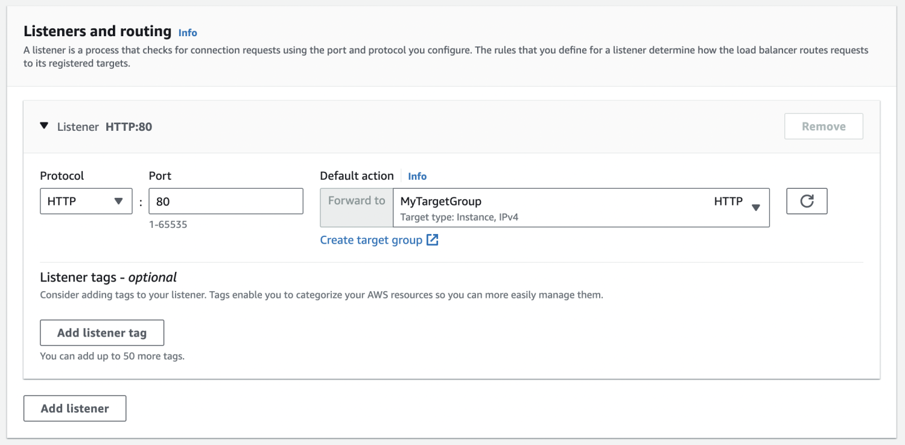
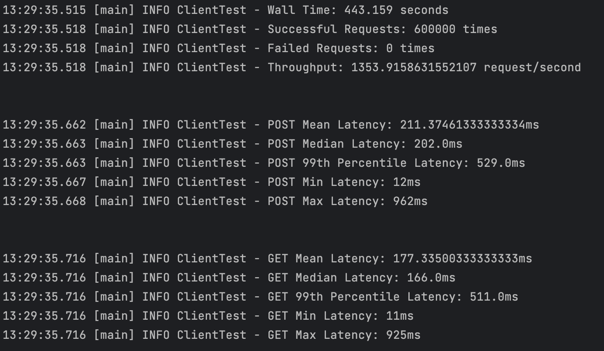

# CS6650 Assignment 2 - Xiaorui Shen

## Handle Data Persistence

### 1. Configuration

- Image size: 3575 bytes (original size)
- Database: AWS RDS PostgreSQL Instance
- Class: db.t3.micro
- RAM: 1GB
- vCPU: 2

### 2. Data model design

single album table:

- `album_id`: A unique auto-incrementing identifier for each album entry, marked as the primary key.
- `artist`: The name of the music artist, which is required for each album.
- `title`: The album title, also a required field.
- `year`: The release year of the album, stored as text but required.
- `image_data`: Binary data for the album’s cover image, optional for each entry.

| Column     | Type         | Constraints |
| ---------- | ------------ | ----------- |
| album_id   | SERIAL       | PRIMARY KEY |
| artist     | VARCHAR(255) | NOT NULL    |
| title      | VARCHAR(255) | NOT NULL    |
| year       | VARCHAR(4)   | NOT NULL    |
| image_data | BYTEA        |             |

Pros:

- Simplicity in design and querying.

- Potentially faster query performance for simple queries due to all data being in a single table.

### 3. Modify sever to access to database

#### New dependecies introduced

- postgresql 42.3.1
- HikariCP 4.0.3

#### Use connection pool lib to handle db connection

#### Function for doPost

#### Function for doGet

#### API Test

## Single server running test

### Overview

### Configuration

- EC2 Instance Type: t2.micro
- Database: AWS RDS PostgreSQL Instance
- Class: db.t3.micro
- DB RAM: 1GB
- DB vCPU: 2

### Test Results

#### 1. Test 1 (threadGroupSize = 10, numThreadGroups = 10, delay = 2):

#### 2. Test 2 (threadGroupSize = 10, numThreadGroups = 20, delay = 2):

#### 3. Test 3 (threadGroupSize = 10, numThreadGroups = 30, delay = 2):

| Metric     | 10-10-2 | 10-20-2 | 10-30-2 |
| ---------- | ------- | ------- | ------- |
| Throughput | 406.33  | 457.27  | 473.84  |

## Two servers running test

### 1. Overview

### 2. Replicate the instance

#### Create AMI for the first server

#### Launch the new server from AMI

### 3. Add Application Load Balancer

#### Create target group and register targets

#### Associate target group with load balancer

#### Passed Healthy Check

### 4. Configuration

- EC2 Instance Type: t2.micro
- Load Balancer Type: Application Load Balancer
- Database: AWS RDS PostgreSQL Instance
- Class: db.t3.micro
- DB RAM: 1GB
- DB vCPU: 2

### 5. Test Result 

#### 1. Test 1 (threadGroupSize = 10, numThreadGroups = 10, delay = 2):

#### 2. Test 2 (threadGroupSize = 10, numThreadGroups = 20, delay = 2):

#### 3. Test 3 (threadGroupSize = 10, numThreadGroups = 30, delay = 2):

| Metric     | 10-10-2 | 10-20-2 | 10-30-2 |
| ---------- | ------- | ------- | ------- |
| Throughput | 638.43  | 753.97  | 876.84  |

## Tune the System

### 1. Monitoring Metrics

#### Monitoring EC2s

Server1

Server2

#### Monitoring Database

### 2. Adjust Database

#### Improve max_connections

Assume the limitation is related to the `max_connections` in database. To improve the `max_connection` in RDS, we can change to database type with more memory.

Databse Configs:

- Instance class: db.t3.medium
- vCPU: 2
- RAM: 4
- Engine: PostgreSQL
- Engine Version: 15.3

The `max_connections` in db improved from 81 to 403

#### Modify pooling manager configs

#### Running Test

### 3. Adjust EC2

#### Overview

#### Add one more EC2

1. **Increased Capacity**: Each EC2 instance provides additional CPU, memory, and network capacity. 
2. **Load Distribution**: ALBs efficiently distribute incoming application traffic across multiple targets, such as EC2 instances, in multiple Availability Zones. This distribution can help to reduce the load on individual instances and prevent any one instance from becoming a bottleneck.
3. **Concurrent Processing**: More instances mean that more requests can be processed concurrently. If requests are independent of each other and don't require shared state, this can linearly scale the number of requests your application can handle.
4. **Database Throttling**: Even if connection pool and database can handle more connections, the EC2 instances themselves might have been CPU or I/O bound, and the database wasn't the bottleneck. Therefore, adding more application servers rather than increasing the database connection pool size can lead to performance improvements.
5. **Network Latency**: With more instances, it's possible that users are being routed to an instance that's closer to them geographically or with less network congestion, resulting in faster responses.

#### Test Result

Query the database

## Summary Metric

| Stage (10-30-2)                      | Throughput |
| ------------------------------------ | ---------- |
| Single-Server                        | 473.84     |
| Two-Servers with ALB                 | 876.84     |
| Database with bigger max_connections | 1050.02    |
| Three-Servers with ALB               | 1353.92    |

